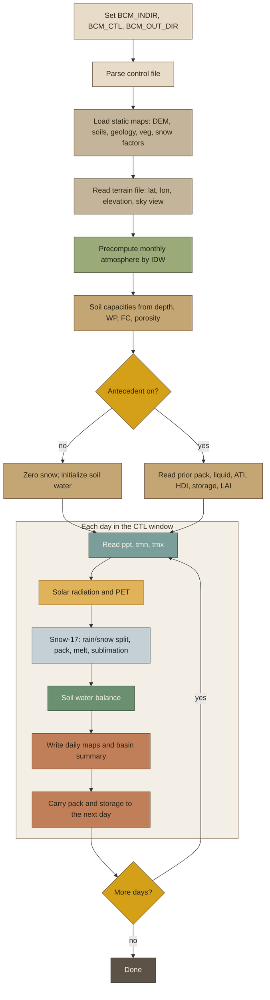
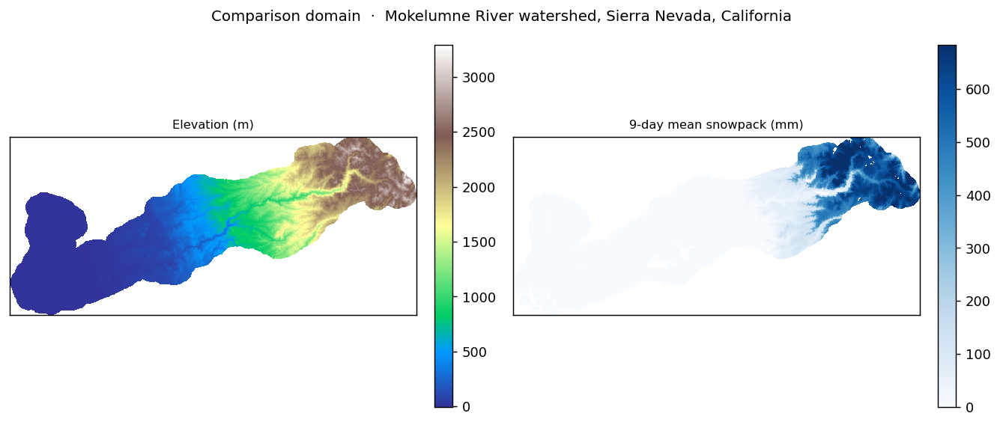
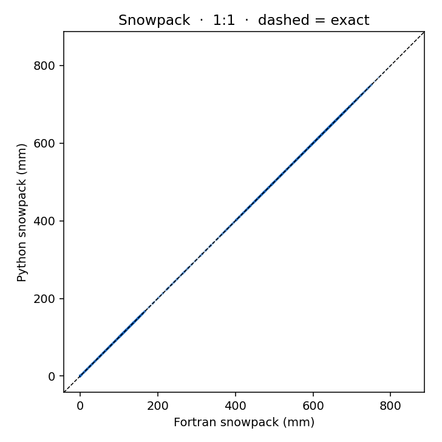
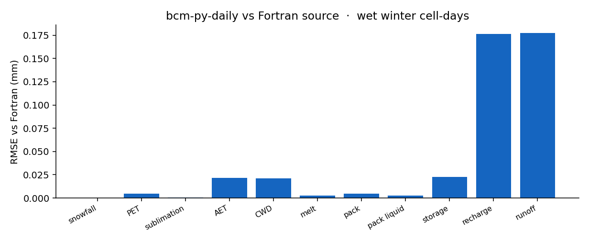
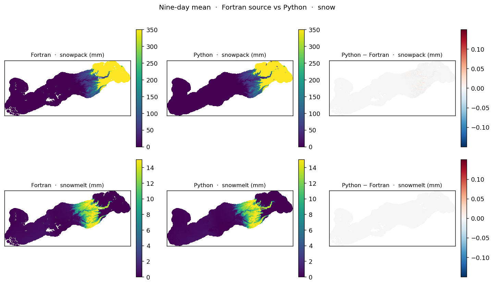
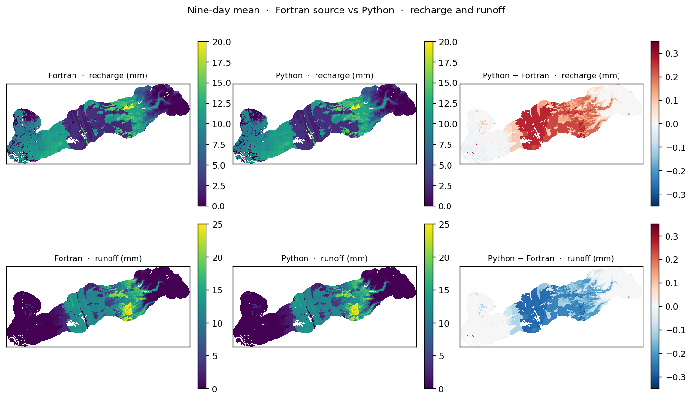

# bcm-py-daily

**Andrew Joros** · Assistant Research Scientist · Desert Research Institute
with **Michelle Stern** · Delta Stewardship Council

Independent **daily** Python implementation of the USGS Basin Characterization
Model (BCM). Public research software.

**This is not a USGS product and is not endorsed by the USGS.**

---

## The Basin Characterization Model

The Basin Characterization Model (BCM) is a simple grid-based model that
calculates the water balance for any time step or spatial scale by using
climate inputs, precipitation, minimum and maximum air temperature. The BCM
can translate fine-scale maps of climate trends and projections into the
hydrologic consequences, to permit evaluation of the impacts to water
availability at regional, watershed, and landscape scales, as caused by
changes in temperature and precipitation.

Scientists divide the landscape into grid cells, each of which uses specific
climate data inputs, such as precipitation and air temperature, to solve the
water balance for each cell. Model calculations include potential
evapotranspiration, calculated from solar radiation with topographic shading
and cloudiness; snow, as it accumulates and melts; and excess water moving
through the soil profile, which is used to calculate actual
evapotranspiration and climatic water deficit—the difference between
potential and actual evapotranspiration. Depending on soil properties and
the permeability of underlying bedrock, surface water can be classified for
each cell as either recharge or runoff. Post-processing calculations are
made to estimate baseflow, streamflow, and potential recharge to the
groundwater system for watersheds. The model output can define the water
balance for any size polygon representing regions or watersheds, or can
define the distribution of the various water-balance variables across the
landscape.

Source: [U.S. Geological Survey, California Water Science Center, Basin
Characterization Model
(BCM)](https://www.usgs.gov/centers/california-water-science-center/science/basin-characterization-model-bcm)

The official BCM page and the BCMv8 software manual describe the USGS model
(including monthly regional applications). This repository is a **daily**
water-balance port in Python.

---

## This repository

**bcm-py-daily** is a public Python port of BCM Daily.

| Role | |
|---|---|
| **Software developer** | Andrew Joros, Assistant Research Scientist, Desert Research Institute |
| **Development** | Michelle Stern, Delta Stewardship Council |
| **BCM method** | U.S. Geological Survey (Flint, Stern, and colleagues) |

The Fortran BCM remains the USGS authors’ model. This repository is DRI /
collaborator software that runs that method in Python. It is not an official
USGS software release.

Run `BCM_Dailyv81_python.py` after pointing it at your own BCM Daily inputs.

---

## How it works

One setup pass, then the same water-balance chain on every grid cell each
day. Climate is precipitation, Tmin, and Tmax. Everything else is
computed.



**Once at start.** The CTL sets dates, print flags, lookup tables, and
whether to restart from yesterday’s state. Static layers and the terrain
file define the grid. Monthly precipitable water, turbidity, and albedo
are interpolated to each cell. Soil field capacity, wilting point, and
porosity are depths in mm. Bedrock Ks comes from the geology table.

**Each day.**

1. **Climate** — precipitation, Tmin, Tmax (same files Fortran uses).
2. **PET** — hourly solar with topographic shading and cloudiness;
   Priestley–Taylor PET for the day.
3. **Snow** — rain vs snow from temperature vs the accumulation map;
   SNOW-17 pack, heat deficit, liquid tank, melt, sublimation.
4. **Soil** — storage gets rain + melt − snow. Added water goes to AET,
   then recharge (capped by bedrock Ks) or runoff. CWD is PET − AET.
5. **Write** — maps whose CTL flags are on, plus state maps for the next
   day, and one basin-average line in the text summary.

State that carries forward: snowpack, pack liquid, ATI, HDI, soil
storage, LAI.

---

## Agreement with Fortran

The port was checked **cell-by-cell** against the Fortran BCM Daily
**source** on the same climate, soils, and control file.

### Comparison region

The test domain is the **Mokelumne River watershed** on the western slope
of the Sierra Nevada, California. It is a 270 m grid (Teale Albers) with
about 177,000 land cells: Central Valley floor on the west, foothills in
the middle, and the high Sierra (deep snow) on the east. Both models used
the same daily precipitation and temperature, the same soils / geology /
vegetation, and the same late-December snow and soil **antecedent** maps.

The window is a **wet** winter sequence: 26 December 1996 through
3 January 1997 (1996 day-of-year 361–366 and 1997 day-of-year 1–3).
That is 9 days × ~77,000 valid cells per day ≈ **690,000 cell-days**.
Mean pack in the window is about 133 mm; soils are wet enough that
recharge and runoff are active. A dry spin-up would hide snow and
runoff errors.



*Left: elevation. Right: nine-day mean snowpack from the Fortran source.*

### Runtime

Same Mokelumne 9-day wet window, same Windows workstation, one run each.
Wall time includes daily ASCII map I/O. Not a formal benchmark.

| | Wall time | Relative |
|---|---:|---|
| Fortran (gfortran `-O2`, same source the port follows) | 103 s | 1.0× |
| Python (this port, NumPy) | 45 s | **2.3× faster** |

Fortran is a per-cell loop. Python is vectorized NumPy over the grid.

### Metrics (Python − Fortran)

**0.000** means identical on the written maps. **~0.005 mm** is the usual
map-write floor (`%.2f`), not a process miss. Bias is Python minus
Fortran.

| Variable | RMSE | Bias |
|---|---:|---:|
| tmin / tmax (°C) | **0.000** | 0.000 |
| precip (mm) | **0.000** | 0.000 |
| snowfall `snw` (mm) | **0.000** | 0.000 |
| sublimation `sbl` (mm) | **0.001** | 0.000 |
| snowmelt `mlt` (mm) | **0.003** | 0.000 |
| pack liquid `mwt` (mm) | **0.003** | 0.000 |
| snowpack `pck` (mm) | **0.005** | 0.000 |
| PET `pet` (mm) | **0.005** | +0.002 |
| excess `exc` (mm) | **0.019** | −0.004 |
| CWD `cwd` (mm) | **0.021** | −0.004 |
| AET `aet` (mm) | **0.022** | +0.006 |
| soil storage `str` (mm) | **0.023** | −0.004 |
| recharge `rch` (mm) | 0.176 | +0.101 |
| runoff `run` (mm) | 0.177 | −0.104 |



*Each point is one grid cell on one day. Dashed line is exact agreement.*



### Spatial comparison

Nine-day means. Fortran and Python snow fields are visually the same;
the difference maps sit at write noise.



Recharge and runoff maps match in pattern. The small, widespread
difference (about +0.3 mm recharge / −0.3 mm runoff) is an optional
control-file **recharge/runoff switch** that Python applies and this
Fortran source does not. Turn that switch off in the CTL for a tighter
match. It is not a snow-physics miss.



Rain/snow fraction maps use opposite labels (Python writes snow
fraction; this Fortran source writes rain fraction). Invert RMSE is
0.0015 (100% within 0.01). That is a write convention, not a water-balance
error.

This comparison is against the Fortran **source** the port was written
from, not a claim of bit-identity with every compiled BCM executable.

---

## Installation

You need **Python 3.10+** and a BCM Daily input folder (control file,
static layers, daily climate). This repo does not ship a domain. You do
not need Fortran, the Windows BCM executable, or conda.

```bash
git clone https://github.com/ajoros/bcm-py-daily.git
cd bcm-py-daily
python3 -m venv .venv
```

Windows (PowerShell): `py -3 -m venv .venv` then
`.\.venv\Scripts\Activate.ps1`  
macOS / Linux: `source .venv/bin/activate`

```bash
python -m pip install --upgrade pip
pip install -r requirements.txt
```

That installs `numpy>=1.24`. Optional, for figures only:
`pip install matplotlib`.

Leave the environment with `deactivate`. Confirm with
`python -c "import numpy; print(numpy.__version__)"`.

---

## Usage

Point the script at **your** BCM Daily inputs. Paths are environment
variables; the control file (`.ctl`) sets dates, print flags, and
whether to start from prior state.

**Windows (PowerShell)**

```powershell
$env:BCM_INDIR   = "C:\path\to\your\bcm_inputs"
$env:BCM_CTL     = "$env:BCM_INDIR\BCM_Dailyv81.ctl"
$env:BCM_OUT_DIR = "C:\path\to\output"
python BCM_Dailyv81_python.py
```

**macOS / Linux**

```bash
export BCM_INDIR=/path/to/your/bcm_inputs
export BCM_CTL=$BCM_INDIR/BCM_Dailyv81.ctl
export BCM_OUT_DIR=/path/to/output
python BCM_Dailyv81_python.py
```

Always set `BCM_INDIR` and `BCM_OUT_DIR`. If `BCM_CTL` is omitted, the
script looks for `BCM_Dailyv81.ctl` inside `BCM_INDIR`. Output folders
are created if missing.

### Inputs

Use the same kind of folder you would use for a Fortran BCM Daily run.
Names in the CTL are file names (not full paths) and are read from
`BCM_INDIR`. All rasters should be ESRI ASCII (`.asc`) on the **same
grid** as the DEM.

**Always**

- Control file: start/end day-of-year and year, print flags, lookup
  tables, antecedent on/off
- Static maps: topography, soils, geology, vegetation, and the snow /
  radiation layers named in the CTL
- Terrain file named in the CTL (lat, lon, elevation, and related fields)
- Daily climate for every day in the window:

| File | Meaning |
|---|---|
| `pptYYYY_DDD.asc` | precipitation (mm) |
| `tmnYYYY_DDD.asc` | minimum air temperature (°C) |
| `tmxYYYY_DDD.asc` | maximum air temperature (°C) |

`DDD` is day-of-year, three digits (`001`–`365` or `366`). Runs may
cross 1 January.

**If antecedent is on** in the CTL, also provide the previous day’s
state maps in the same folder (snowpack, soil storage, and the other
state layers BCM Daily writes). If antecedent is off, the run starts
with no snow and initialized soil water.

### Outputs

Written to `BCM_OUT_DIR`:

- A text basin summary (name from the CTL): daily averages of precip,
  PET, snow, melt, storage, recharge, runoff, and related terms
- Daily ASCII maps for each variable whose print flag is on, plus the
  usual state maps (pack, storage, and related)

Maps use the same `varYYYY_DDD.asc` naming as the climate inputs.

### Environment variables

| Variable | Meaning |
|---|---|
| `BCM_INDIR` | Input folder (required) |
| `BCM_CTL` | Control file (default: `BCM_Dailyv81.ctl` in the input folder) |
| `BCM_OUT_DIR` | Output folder (recommended) |
| `BCM_QUIET` | Set to `1` to skip per-day console lines |

### Checklist

1. Put a BCM Daily CTL and matching grids in one folder.
2. Set the CTL dates to days you have precip and temperature for.
3. Turn on the map flags you want; set antecedent on or off.
4. Activate the venv, set the three path variables, run the script.
5. Open the text summary for basin averages; open `*.asc` maps in a GIS.

Runtime scales with grid size and number of days. A large regional grid
needs several GB of RAM.

### If it fails

| Symptom | Likely cause |
|---|---|
| Control file not found | `BCM_INDIR` or `BCM_CTL` is wrong |
| A climate file not found | CTL window includes a day you do not have, or `DDD` is not three digits |
| A state file not found at start | Antecedent is on, but the previous day’s maps are missing |
| Array shape error | One layer is not the same `nrows` × `ncols` as the DEM |
| `numpy` import error | Virtual environment not active |

---

## Dependencies

| Required to run the model | Optional |
|---|---|
| Python 3.10+ | `matplotlib` ≥ 3.7 — figures only |
| `numpy` ≥ 1.24 | A Fortran BCM build — only if you repeat the comparison |

No compiled extensions and no USGS binaries. The model is the Python
standard library plus NumPy.

**You provide (not installed by pip):** ASCII grids and a CTL in the BCM
Daily layout. Same class of climate inputs: precipitation, minimum and
maximum air temperature, plus soils, geology, and topography.

**You do not need:** a compiled BCM executable, a Fortran compiler, or
pandas.

---

## Credit

- **This Python software:** Andrew Joros, Assistant Research Scientist,
  Desert Research Institute.
- **Development:** [Michelle Stern](https://github.com/michelleastern),
  Delta Stewardship Council.
- **BCM method:** U.S. Geological Survey. See the
  [USGS BCM page](https://www.usgs.gov/centers/california-water-science-center/science/basin-characterization-model-bcm)
  and Flint, L.E., Flint, A.L., and Stern, M.A., 2021, *The basin
  characterization model—A regional water balance software package*:
  U.S. Geological Survey Techniques and Methods.

Cite this repository for the Python port. Cite Flint, Flint, and Stern
(2021) and the USGS BCM page for the model.

---

## Disclaimer

Not an official USGS software release. Reference to USGS products or
personnel does not imply endorsement. Use at your own risk.

---

## License

Copyright (c) 2026 Andrew Joros, Desert Research Institute  
SPDX-License-Identifier: [MIT](LICENSE)

This license is for the Python software in this repository. It does not
cover USGS BCM Fortran source, compiled BCM executables, or input data.
