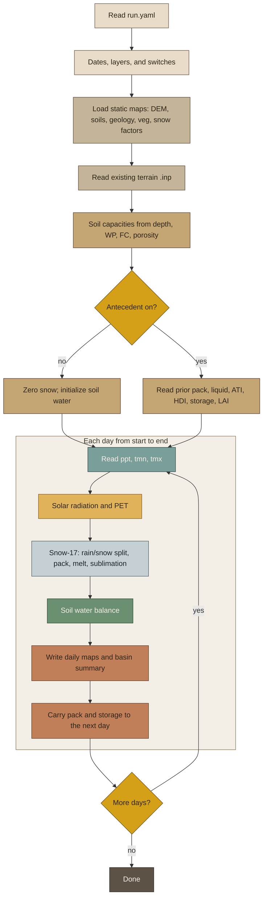

# bcm-py-daily

**Andrew Joros** · Assistant Research Scientist · Desert Research Institute
with **Michelle Stern** · Senior Environmental Scientist · Delta Stewardship Council

Independent **daily** Python implementation of the published monthly USGS Basin Characterization
Model (BCMv8). Public research software.

**This is not a USGS product and is not endorsed by the USGS.**

## Quick start

A first run uses Python only: `run.yaml`, the grids you put in `domain/`,
and the lookup tables shipped in `bcm_tables/`. You do not need a Fortran
compiler, a `.ctl` file, or a compiled BCM executable.

**Windows (PowerShell)**

```powershell
py -3 -m venv .venv
.\.venv\Scripts\Activate.ps1
py -m pip install -r requirements.txt
py -m bcm check run.yaml
py -m bcm run run.yaml
```

**macOS / Linux**

```bash
python3 -m venv .venv
source .venv/bin/activate
pip install -r requirements.txt
python -m bcm check run.yaml
python -m bcm run run.yaml
```

`check` lists anything still missing. On a fresh clone, `domain/` is empty,
so `check` will name the grids you have not copied in yet. That is the
setup list, not a broken install.

### Set up your watershed

1. Open `run.yaml`. Set `start` and `end`. Leave the keys on the left as
   they are. Put your filenames on the right.
2. Copy your grids into `domain/`. Every map must match the DEM: same
   rows, columns, and cell size. `geology.csv` and `vegetation.csv` are
   already in `bcm_tables/`. Renaming `geology.asc` or `vegetation.asc`
   does not rename those tables. The grid id joins to the table id.
3. Put daily climate in `domain/`, or in another folder and set
   `climate: ./climate`. One file per day:
   `pptYYYY_DDD.asc`, `tmnYYYY_DDD.asc`, `tmxYYYY_DDD.asc`
   (1 Jan 2010 is `ppt2010_001.asc`). Potential evapotranspiration is
   calculated. Do not add a PET grid.
4. Leave the shipped switches alone for a first run. `antecedent: false`
   starts with no snow and initialized soil water. `drydown: off` does
   not need an aridity map. `ingest: off` ignores the example file pairs.
   `rch_run: off` does not move runoff into recharge. Change `rch_run`
   only during streamflow calibration, or if you have baseflow information.
5. Run `python -m bcm check run.yaml`, then `python -m bcm run run.yaml`.
6. Daily maps and `basin.out` are written to `out/`. `print:` in
   `run.yaml` chooses which maps are written. Snowpack, soil storage, and
   the other state maps are written either way so the next day can start.

`terrain.inp` is a data file you supply (latitude, longitude, slope,
aspect, sky view, and horizon angles). This package reads it. It does
not build it from the DEM.

---

## The Basin Characterization Model

The Basin Characterization Model (BCM) is a grid-based model that
calculates the water balance for any time step or spatial scale by using
climate inputs of precipitation, minimum and maximum air temperature. The BCM
can translate fine-scale maps of climate trends and projections into the
hydrologic consequences, to permit evaluation of the impacts to water
availability at regional, watershed, and landscape scales, as caused by
changes in temperature and precipitation.

Users can divide the landscape into grid cells, each of which uses specific
climate data inputs, such as precipitation and air temperature, to solve the
water balance for each cell. Model calculations include potential
evapotranspiration, calculated from solar radiation with topographic shading
and cloudiness; snow, as it accumulates and melts; and excess water moving
through the soil profile, which is used to calculate actual
evapotranspiration and climatic water deficit—the difference between
potential and actual evapotranspiration. Depending on soil properties and
the permeability of underlying bedrock, surface water is classified for
each cell as either recharge or runoff. Post-processing calculations can be 
made to estimate baseflow, streamflow, and potential recharge to the
groundwater system for watersheds. The model output text file can summarize the water
balance for any grid cell or polygon representing regions or watersheds. Model output grids
define the distribution of the various water-balance variables across the
landscape.

Source: [U.S. Geological Survey, California Water Science Center, Basin
Characterization Model
(BCM)](https://www.usgs.gov/centers/california-water-science-center/science/basin-characterization-model-bcm)

The official BCM page and the BCMv8 software manual describe the USGS model
(including monthly regional applications). This repository is a **daily**
water-balance port in Python.

---

## This repository

**bcm-py-daily** is a public Python port of BCM Daily.

| Role | |
|---|---|
| **Software developer** | Andrew Joros, Assistant Research Scientist, Desert Research Institute |
| **Developer** | Michelle Stern, Delta Stewardship Council |
| **BCM method** | U.S. Geological Survey (Flint, Flint, and Stern) |

The Fortran BCM remains the USGS authors’ model. This repository is DRI /
collaborator software that runs that method in Python. It is not an official
USGS software release.

Run `python -m bcm run run.yaml` after you have filled in that file and
copied your grids into `domain/`.

---

## How it works

One setup pass, then the same water-balance chain on every grid cell each
day. Climate is precipitation, Tmin, and Tmax. Everything else is
computed.



**Once at start.** `run.yaml` sets the dates, which maps to write, and
whether to restart from yesterday’s state. Static layers and `terrain.inp`
define the grid. Monthly precipitable water, turbidity, and albedo are
interpolated to each cell. Soil field capacity, wilting point, and
porosity are depths in mm. Bedrock conductivity comes from `geology.csv`.
Actual evapotranspiration demand is PET times the vegetation k-factor for
that day (`vegetation.csv`). Root depth from that table is added to soil
depth. Leaf area stays at 1.

**Each day.**

1. **Climate** — precipitation, Tmin, Tmax.
2. **PET** — hourly solar with topographic shading and cloudiness;
   Priestley–Taylor PET for the day. The model calculates this.
3. **Snow** — rain vs snow from temperature vs the accumulation map;
   SNOW-17 pack, heat deficit, liquid tank, melt, sublimation.
   Sublimation uses the PET equation unless you turn that switch on.
4. **Soil** — storage gets rain + melt − snow. Excess water goes to AET,
   then recharge (capped by bedrock Ks) or runoff. CWD is PET − AET.
   With `drydown: on`, storage below wilting point is reduced using the
   aridity map.
5. **Write** — the maps named in `print:`, plus state maps for the next
   day, and one basin-average line in `basin.out`.

States that carry forward: snowpack, pack liquid, ATI, HDI, soil
storage, LAI.

---

## Agreement with Fortran

The port was checked **cell-by-cell** against the Fortran BCM Daily
**source** on the same climate, soils, and control file.

### Comparison region

The test domain is the **Mokelumne River watershed** on the western slope
of the Sierra Nevada, California. It is a 270 m grid (Teale Albers) with
about 177,000 land cells: Central Valley floor on the west, foothills in
the middle, and the high Sierra (deep snow) on the east. Both models used
the same daily precipitation and temperature, the same soils / geology /
vegetation, and the same late-December snow and soil **antecedent** maps.

The window is a **wet** winter sequence: 26 December 1996 through
3 January 1997 (1996 day-of-year 361–366 and 1997 day-of-year 1–3).
That is 9 days × ~77,000 valid cells per day ≈ **690,000 cell-days**.
Mean pack in the window is about 133 mm; soils are wet enough that
recharge and runoff are active. A dry spin-up would hide snow and
runoff errors.


*Left: elevation. Right: nine-day mean snowpack from the Fortran source.*

### Runtime

Same Mokelumne 9-day wet window, same Windows workstation, one run each.
Wall time includes daily ASCII map I/O. Not a formal benchmark.

| | Wall time | Relative |
|---|---:|---|
| Fortran (gfortran `-O2`, same source the port follows) | 103 s | 1.0× |
| Python (this port, NumPy) | 45 s | **2.3× faster** |

Fortran is a per-cell loop. Python is vectorized NumPy over the grid.

### Metrics (Python − Fortran)

**0.000** means identical on the written maps. **~0.005 mm** is the usual
map-write floor (`%.2f`), not a process miss. Bias is Python minus
Fortran.

| Variable | RMSE | Bias |
|---|---:|---:|
| tmin / tmax (°C) | **0.000** | 0.000 |
| precip (mm) | **0.000** | 0.000 |
| snowfall `snw` (mm) | **0.000** | 0.000 |
| sublimation `sbl` (mm) | **0.001** | 0.000 |
| snowmelt `mlt` (mm) | **0.003** | 0.000 |
| pack liquid `mwt` (mm) | **0.003** | 0.000 |
| snowpack `pck` (mm) | **0.005** | 0.000 |
| PET `pet` (mm) | **0.005** | +0.002 |
| excess `exc` (mm) | **0.019** | −0.004 |
| CWD `cwd` (mm) | **0.021** | −0.004 |
| AET `aet` (mm) | **0.022** | +0.006 |
| soil storage `str` (mm) | **0.023** | −0.004 |
| recharge `rch` (mm) | 0.176 | +0.101 |
| runoff `run` (mm) | 0.177 | −0.104 |


*Each point is one grid cell on one day. Dashed line is exact agreement.*


### Spatial comparison

Nine-day means. Fortran and Python snow fields are visually the same;
the difference maps sit at write noise.


Recharge and runoff maps match in pattern. The small, widespread
difference (about +0.3 mm recharge / −0.3 mm runoff) is `rch_run` in
`run.yaml`. The shipped file leaves it `off`. A number moves that many
millimeters per day from runoff into recharge after bedrock K has capped
recharge. The Fortran source used in this comparison does not apply that
shift. It is not a snow-physics miss.


Rain/snow fraction maps use opposite labels (Python writes snow
fraction; this Fortran source writes rain fraction). Invert RMSE is
0.0015 (100% within 0.01). That is a write convention, not a water-balance
error.

This comparison is against the Fortran **source** the port was written
from, not a claim of bit-identity with every compiled BCM executable.

---

## Installation

You need **Python 3.10+**. Climate and input grids must match the DEM
(same rows, columns, and cell size). `domain/` and `out/` are empty
folders in the repository. This package does not build `terrain.inp`
from a DEM. You do not need Fortran, a control file, the Windows BCM
executable, or conda.

```bash
git clone https://github.com/ajoros/bcm-py-daily.git
cd bcm-py-daily
python3 -m venv .venv
```

Windows (PowerShell): `py -3 -m venv .venv` then
`.\.venv\Scripts\Activate.ps1`  
macOS / Linux: `source .venv/bin/activate`

```bash
python -m pip install --upgrade pip
pip install -r requirements.txt
```

That installs `numpy>=1.24`. Optional, for figures only:
`pip install matplotlib`.

Leave the environment with `deactivate`. Confirm with
`python -c "import numpy; print(numpy.__version__)"`.

---

## Usage

Edit `run.yaml`, then:

```bash
python -m bcm check run.yaml
python -m bcm run run.yaml
```

`check` reads the YAML and reports missing files. `run` refuses to start
while `check` still reports a missing grid. Paths in the YAML are relative
to the YAML file. `domain:` is the folder of static grids. `climate:` is
the folder of daily precipitation and temperature. `output:` is where maps
are written (`./out` in the shipped file).

### What you edit in `run.yaml`

| Key | What to set |
|---|---|
| `start`, `end` | First and last day (`YYYY-MM-DD`) |
| `domain`, `climate`, `output` | Folders. Climate defaults to `./domain`. Use `./climate` if those files live somewhere else |
| `layers:` | Your filenames. The comment on each line says what the grid is |
| `antecedent` | `false` for a new run. `true` only if the day before `start` is already in the domain folder |
| `initial_soil` | Starting soil water as a fraction of (field capacity − wilting point). Shipped value is `0.9` |
| `timezone` | Standard meridian in degrees longitude. California is `-120` |
| `print` | Which daily maps to write |
| `flags` | Leave the shipped values for a first run. Notes are on each line |

### Grids you put in `domain/`

ESRI ASCII (`.asc`), same rows, columns, and cell size as the DEM.
Filenames are whatever you wrote under `layers:`.

| Role | What it is |
|---|---|
| `dem` | Elevation, meters |
| `soil_depth`, `wilting_point`, `field_capacity`, `porosity` | Soil |
| `geology` | Geology id. Joins to `geology.csv` |
| `vegetation` | Vegetation id. Joins to `vegetation.csv` |
| `bc_a`, `bc_b`, `bc_c` | Bristow–Campbell transmissivity |
| `pt_alpha` | Priestley–Taylor alpha map. PET still uses 1.26 |
| `snow_accum`, `mfmax`, `mfmin` | Snow maps. Used when `snow: maps` |
| `basins` | Basin id for the summary table |
| `terrain` | `terrain.inp`: latitude, longitude, slope, aspect, sky view, horizons |
| `aridity` | Only when `drydown: on` |

Daily climate, in the `climate` folder, for every day from `start` through `end`:

| File | Meaning |
|---|---|
| `pptYYYY_DDD.asc` | precipitation (mm) |
| `tmnYYYY_DDD.asc` | minimum air temperature (°C) |
| `tmxYYYY_DDD.asc` | maximum air temperature (°C) |

`DDD` is day-of-year, three digits (`001`–`365` or `366`). A run may
cross 1 January.

With `antecedent: true`, also put the previous day’s state maps in the
domain folder (snowpack, soil storage, ATI, HDI, LAI). With
`antecedent: false`, the run starts with no snow and initialized soil water.

### Switches worth knowing

The comments in `run.yaml` are the full list. For a first watershed,
leave them as shipped.

- `rch_run: off` keeps recharge and runoff as the soil routine computed
  them. A number, such as `0.300`, moves up to that many millimeters per
  day from runoff into recharge. Change it only for streamflow
  calibration, or if you have baseflow information.
- `drydown: on` reads `layers.aridity` and dries the soil below wilting
  point with `a*exp(b*aridity)+c`.
- `ingest: off` ignores `ingest_files`. `swe`, `str`, or `lai` means you
  are replacing snowpack, soil storage, or leaf area. The left name is
  the model file. The right name is the grid you supply, in `domain/`.
- `pt_modified`, `urban`, and `rain_fraction` are recorded. They do not
  change the water balance in this version. Leave them `off`.
- `sublimation: off` uses the equation that relates PET and sublimation.
  That is the calculation the run performs.

### Outputs

Written to the `output` folder:

- `basin.out` (or the name in `outfile`): one line per day of basin
  averages for precipitation, PET, snow, melt, storage, recharge, runoff,
  and related terms
- Daily ASCII maps for each name in `print:`, plus state maps (pack,
  storage, and related) for the next day

Maps use the same `varYYYY_DDD.asc` naming as the climate inputs.

Set `BCM_QUIET` to `1` to skip the per-day console lines.

### Checklist

1. Activate the virtual environment and `pip install -r requirements.txt`.
2. Set dates and filenames in `run.yaml`.
3. Copy grids into `domain/` and climate files into the climate folder.
4. `python -m bcm check run.yaml` until it prints `ok`.
5. `python -m bcm run run.yaml`.
6. Open `out/basin.out` for basin averages and the `*.asc` maps in a GIS.

Runtime scales with grid size and number of days. A large regional grid
needs several GB of RAM.

### If it fails

| Symptom | Likely cause |
|---|---|
| `check` says domain folder not found | `domain:` in `run.yaml` does not point at a folder |
| A climate file not found | `start`/`end` includes a day you do not have, or `DDD` is not three digits |
| A layer file not found | The filename under `layers:` is not in `domain/` |
| A state file not found at start | `antecedent: true`, but the previous day’s maps are missing |
| Ingest replacement missing | `ingest` is `swe`, `str`, or `lai` and the right-hand file is not in `domain/` |
| Array shape error | One layer is not the same `nrows` × `ncols` as the DEM |
| `numpy` import error | Virtual environment not active, or `pip install -r requirements.txt` was not run |

### If you already have a Fortran control file

You do not need one to start. If you have one and want the same filenames
written into a YAML, this copies them. It does not run Fortran.

```bash
python -m bcm import-ctl path/to/BCM_Dailyv81.ctl -o run.yaml
```

Read the new `run.yaml` before you run. The shipped defaults (`rch_run: off`,
`drydown: off`) are the first-run settings. An imported file keeps the
switches that were in the control file.

---

## Dependencies

| Required to run the model | Optional |
|---|---|
| Python 3.10+ | `matplotlib` ≥ 3.7 — figures only |
| `numpy` ≥ 1.24 | A Fortran BCM build — only if you repeat the comparison |

No compiled extensions and no USGS binaries. The model is the Python
standard library plus NumPy.

**You provide (not installed by pip):** the grids named in `run.yaml`
(soils, geology, vegetation, topography, terrain, and daily precipitation
and temperature). `geology.csv` and `vegetation.csv` ship with the package.

**You do not need:** a `.ctl` file, a compiled BCM executable, a Fortran
compiler, or pandas.

---

## Credit

- **This Python software:** Andrew Joros, Assistant Research Scientist,
  Desert Research Institute.
- **Developer:** [Michelle Stern](https://github.com/michelleastern), Senior Environmental Scientist,
  Delta Stewardship Council.
- **BCM method:** U.S. Geological Survey. See the
  [USGS BCM page](https://www.usgs.gov/centers/california-water-science-center/science/basin-characterization-model-bcm)
  and Flint, L.E., Flint, A.L., and Stern, M.A., 2021, *The basin
  characterization model—A regional water balance software package*:
  U.S. Geological Survey Techniques and Methods.

Cite this repository for the Python port. Cite Flint, Flint, and Stern
(2021) and the USGS BCM page for the model.

---

## Disclaimer

Not an official USGS software release. Reference to USGS products or
personnel does not imply endorsement. Use at your own risk.

---

## License

Copyright (c) 2026 Andrew Joros, Desert Research Institute  
SPDX-License-Identifier: [MIT](LICENSE)

This license is for the Python software in this repository. It does not
cover USGS BCM Fortran source, compiled BCM executables, or input data.
